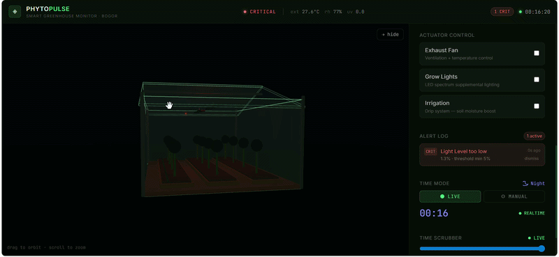

# PhytoPulse — Industrial-Grade Digital Twin for Smart Agriculture



## 💡 The Vision: Spatial Intelligence for Precision Farming

**PhytoPulse** is a high-fidelity **Digital Twin** platform designed to revolutionize how greenhouse operators interact with environmental data. Moving beyond traditional 2D flat dashboards, PhytoPulse provides a **3D spatial context** that enables faster anomaly detection and more intuitive resource management.

In a commercial setting, PhytoPulse delivers tangible business value by:

- **Optimizing Yield**: Precise monitoring of CO₂, soil moisture, and light levels ensures plants stay in the "growth sweet spot."
- **Risk Mitigation**: Real-time alerts and visual pulse indicators prevent crop loss due to equipment failure or climate shifts.
- **Operational Clarity**: The 3D scene provides an immediate "vibe check" of the facility, reducible to seconds of observation.

---

## 🏗️ From Demonstration to Industrial Reality

PhytoPulse currently operates as a **high-fidelity demonstration platform**. While it uses simulated data to showcase its capabilities, the architecture is built for **production-readiness**. This project serves as a modular foundation where 3D assets, sensor parameters, and data sources can be tailored to match the specific geometry and hardware of any physical greenhouse.

### Hardware Integration Guide (Swap-Ready)

To transition from the current simulation to a live hardware environment, follow these professional guidelines:

1. **Define Parameters** (`src/store/usePhytoStore.js`)  
   Modify the `THRESHOLDS` object to match your physical sensors' specifications (Min/Max ranges, units, and labels). The entire UI and alerting logic will adapt automatically.

2. **Connect Data Source** (`src/hooks/useDataEngine.js`)  
   Replace the `simulateSensors()` call with your actual data fetching logic.
   - Establish a connection via **MQTT**, **WebSockets**, or **REST API**.
   - Map your hardware's JSON payload to the `updateSimulated()` action in the state store.

3. **Bind Actuators** (`src/components/ActuatorPanel.jsx`)  
   The `setActuator` action provides the current state of fans, lights, and irrigation. Bind these state changes to outbound commands (e.g., sending a `1/0` signal via a POST request or MQTT pub) to control physical relays through an ESP32 or Arduino.

4. **Customize Environment** (`src/components/GreenhouseScene.jsx`)  
   Swap the default 3D greenhouse meshes with your own **GLTF/GLB models** to accurately reflect the spatial layout of your specific facility.

---

## 🚀 Key Features

### 1. 3D Digital Twin Visualization

Powered by **Three.js** and **React Three Fiber**, featuring dynamic shaders and materials.

- **Contextual Growth**: Plant size and color adapt dynamically to soil moisture health.
- **Physical Feedback**: Fans rotate based on actual temperature data; grow lights emit representative spectral glow.
- **Dynamic Skybox**: The environment lighting and sky state synchronize with the 24-hour solar cycle.

### 2. Temporal Analysis & Scrutiny

- **Deep Historical Scrubber**: Drag through the last 24 hours of data to analyze "butterfly effects" of climate changes.
- **Trend Visualization**: Integrated sparklines for immediate rate-of-change analysis.

### 3. Tiered Alerting System

Industrial-standard threshold monitoring with visual/logic-based alerting. Filters anomalies from noise using threshold hysteresis logic.

---

## 🛠️ Enterprise Tech Stack

| Layer              | Technology      | Rationale                                                      |
| ------------------ | --------------- | -------------------------------------------------------------- |
| **Reactive UI**    | React 18 + Vite | Ensures sub-100ms UI responsiveness and modern build tooling.  |
| **Spatial Engine** | Three.js (R3F)  | High-performance WebGL rendering for the Digital Twin.         |
| **State Fabric**   | Zustand         | Low-overhead state management for high-frequency data streams. |
| **Data Viz**       | Recharts        | Precise mathematical representation of historical trends.      |
| **Industrial CSS** | Tailwind CSS    | Utility-first styling for a consistent, dark-themed dashboard. |

---

## 📦 Project Structure

```text
src/
├── store/          # usePhytoStore (Single Source of Truth)
├── engine/         # Simulation logic & External Weather API
├── hooks/          # Data Engine Orchestrator (Polling & Sync)
├── components/     # High-fidelity UI & 3D Environment Components
└── App.jsx         # System Shell & Layout
```

---

## ⚙️ Installation & Setup

1. **Clone & Install Dependencies**

   ```bash
   npm install
   ```

2. **Environment Configuration** (Optional)
   Add your OpenWeatherMap API key to `.env` for live weather anchoring.

   ```bash
   VITE_OPENWEATHER_API_KEY=your_key_here
   ```

3. **Launch Dev Server**
   ```bash
   npm run dev
   ```

---

## 🛣️ Future Roadmap

- [ ] **Native MQTT Integration**: Out-of-the-box support for ESP32/LoRaWAN modules.
- [ ] **Predictive AI**: Implementation of LSTM models to predict nutrient deficiencies before they manifest visually.
- [ ] **Multi-Facility View**: Global map integration for managing multiple greenhouses.

---

## 📜 License

This project is licensed under the MIT License - see the [LICENSE](LICENSE) file for details.

---

## 🧑‍💻 Author

**Naufal Auzan R**
Computer Engineering, Vocational School IPB University
[Portfolio](your-portfolio-url) | [LinkedIn](your-linkedin-url)

---
